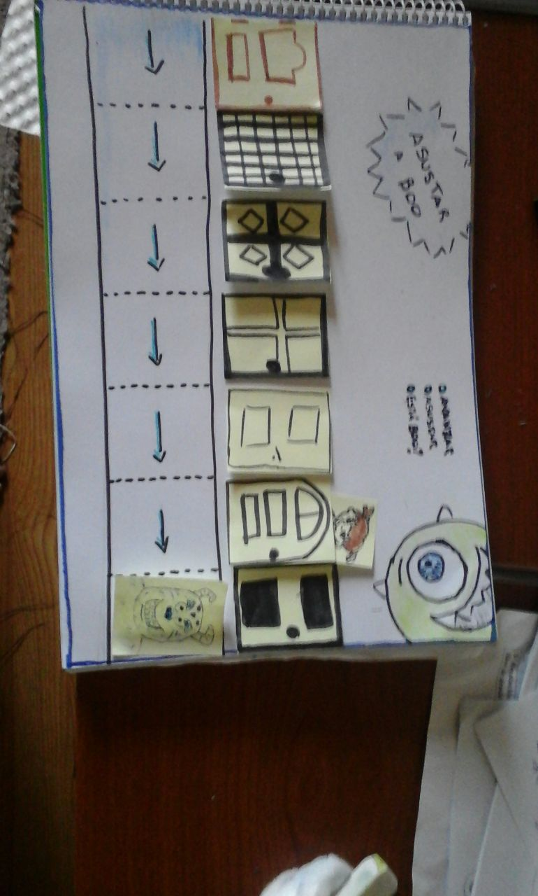

# Clase 3 - Programación segunda clase

## Conexión

*Tiempo estimado: 10 min*

Plantear el problema de un Robot que tiene que encontrar un objeto escondido en un laberinto. El laberinto tiene bifurcaciones y sólo puede utilizar 8 comandos. El robot tiene 7 instrucciones:
- avanzar  
- girar izq 
- girar der 
- hay camino enfrente?
- hay camino a la izq?
- hay camino a la der?
- está el objeto?

Un ejemplo en seudocódigo:

```
"repetir mientras no" encontreObjeto()
    "si" hayCaminoEnfrente()
        avanzar()
    "si" hayCaminoADerecha()
        girarDerecha()
    "si" hayCaminoAIzquierda()
        girarIzquierda()
```

La idea es que piensen sobre que no alcanzan con esas instrucciones y que necesitan una forma de preguntar / sensar (if) y una forma de repetir instrucciones (while/for). No es requisito encontrar la solución, sino sólo reflexionar sobre la necesidad de estas instrucciones.

## Conexión - Alternativa

¡ Asustar a Boo !



Sullivan (monstruo) tiene que asustar a Boo (la beba), para eso debe recorrer puerta a puerta y asustarla cuando la encuentre. 

**Instrucciones para Sullivan**

- avanzar: Sullivan solo puede avanzar de puerta en puerta.
- asustar: Entra a la habitación y asusta a Boo. Solo puede asustar 1 vez y finaliza el trabajo.
- está Boo?: Sullivan espía por la cerradura de la puerta para ver si esta Boo. (SI/NO)

1. Sullivan ve a Boo que entra en la 4ta puerta. 
2. Sullivan no sabe en que puerta entró Boo, sin embargo puede espiar por la cerradura para ver si está o no. (Condicional)
3. Wazowski logro una manera de encontrar y asustar a Boo con solo 3 comandos/ordenes a Sullivan.  (Ciclo)
```
"repetir mientras no" está Boo?
     avanzar
asustar 
```
## Concepto

**Tipos de instrucciones:**

   - comandos:
       - avanzar
       - girar
   - sensores:
       - hay camino?
       - encontré objeto?
   - control de flujo
       - pregunta / condición
       - repetir instrucciones / ciclo

## Práctica: 

- Charlar sobre estos conceptos

- Hacer ejercicios con Pilas Bloques / [Blockly](https://blockly-games.appspot.com/), en particular se puede realizar el [nivel del laberinto de blockly](https://blockly-games.appspot.com/maze)


Pasar [video Ética en la informática](https://www.youtube.com/watch?v=lYW3FoTaVLg)

## Conclusión:
*Tiempo estimado: 20 min*

 1) Preguntas/dudas, charlar brevemente sobre lo aprendido

 2) Mini retro: qué te gustó y que no y qué te gustaría ver la próxima clase, post it en el pizarrón          
 
 Que me gustó | Que no me gustó  | Que más quiero ver
 --- | --- | ---
  |  |
  |  |
